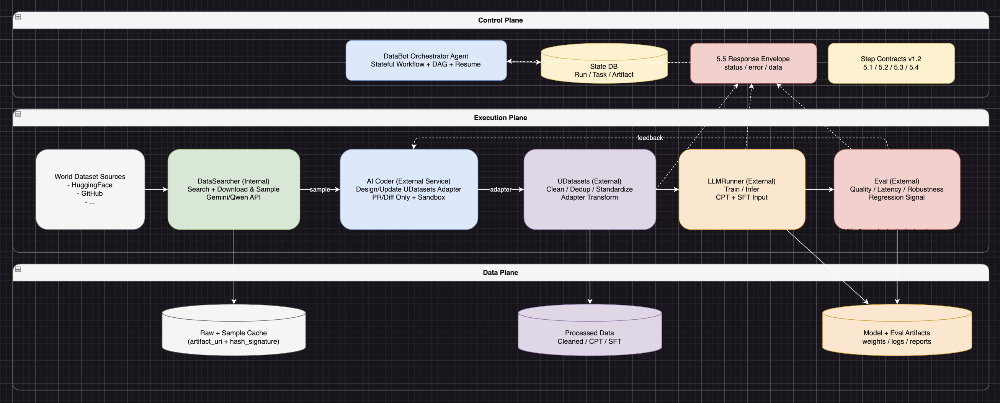

# DataBot Architecture Overview



# DataBot Pipeline Architecture

## 1. 目标与系统定位

- **唯一总控**：`DataBot` 作为全链路唯一控制面，负责统筹大模型数据飞轮（Data Flywheel）的完整生命周期。
- **边界清晰**：`DataBot` 不侵入外部模块（`UDatasets`、`LLMRunner`、`Eval`）内部数据治理与业务逻辑，仅通过标准契约（Contracts）进行跨模块调度、状态流转与数据血缘（Lineage）追踪。
- **闭环进化**：实现“数据发现 -> 清洗 -> 训练 -> 评测 -> 策略回流”的自动化闭环，确保系统具备自愈与自我优化能力。

## 2. 总体系统分层

### 2.1 控制层（Control Plane）

- **组件**：`DataBot Orchestrator Agent`
- **职责**：有状态工作流编排、DAG 任务调度、断点续跑、异常捕获、数据血缘记录。以 `SQLite` 维护幂等状态，以严格代码循环控制主干流程。

### 2.2 执行层（Execution Plane）

- **内部执行器**：`DataSearcher`（含 Download & Sample，DataBot 仓内原生能力）
- **外部执行器**：`UDatasets`（数据处理）、`LLMRunner`（模型训练/推理）、`Eval`（评测）、`AI Coder`（代码修复）

### 2.3 数据层（Data Plane）

- **内容**：原始数据、标准化数据（Cleaned/SFT/CPT）、模型权重、评测报告、运行元数据

## 3. 模块职责与接口路径规范

为保障跨环境协作与 CI/CD 部署，外部模块本地路径禁止硬编码，必须通过配置文件或环境变量（如 `UDATASETS_HOME`）动态注入。

### 3.1 DataSearcher（内置发现模块 / 语义路由中枢）

- **职责**：作为数据获取的感知与路由中枢。接收自然语言或结构化查询，优先走标准化工具链路完成实时检索与候选组装。
- **核心检索与路由策略（Semantic Routing & Function Calling）**：
  - **严禁纯 Prompt 检索与动态执行**：绝不允许让大模型“凭空”生成 URL 以杜绝幻觉，也**绝对禁止**大模型在运行时动态编写并直接执行未知的爬虫代码。
  - **分支 A（标准链路 / 工具命中，当前唯一启用）**：
    1) LLM 只负责语义解析与函数参数生成（Function Calling）；  
    2) 本地 Python Tool（`function_tools.py`）执行真实 API 调用（`api_clients/huggingface_api.py`、`api_clients/github_api.py`）；  
    3) `source_selector.py` 按 `source_policy.json` 强制配比（MVP: HF 60% / GitHub 40%）并完成候选筛选；  
    4) 输出统一结构化结果（真实 `repo_id/source_url`、可执行下载命令、校验元数据、样本文件 URI）。
  - **分支 B（非标链路 / 工具缺失）**：**留空（TODO）**。当前版本不触发 `REQUIRE_NEW_TOOL`，仅在响应中标记 `branch_b.implemented=false`。
- **数据源配比控制（Source Policy）**：
  - 在标准链路中，必须通过配置文件 `source_policy.json` 强控数据源获取比例，不可由大模型自由发散。
  - **MVP 阶段限定双源头**：`HuggingFace (60%)` 代表结构化开箱即用数据；`GitHub (40%)` 代表半结构化复杂数据（需深度清洗）。
- **输入**：领域、语言、许可、配额策略等配置。
- **输出**：
  - **常态输出（已实现）**：带真实校验元数据的候选数据集清单及本地样本 URI（交接给 UDatasets）。
  - **路由输出（分支 B）**：暂未实现（保留占位）。

### 3.2 UDatasets（外部数据处理）

- **默认注入路径**：`${UDATASETS_HOME:-/home/unlimitediw/workspace/UDatasets}`
- **职责**：执行强规则数据清洗、去重、标准化，以及目标格式（AgentData、Toucan 等）Adapter 转换。

### 3.3 LLMRunner（外部训练与推理）

- **默认注入路径**：`${LLMRUNNER_HOME:-/home/unlimitediw/workspace/LLMRunner}`
- **职责**：接管处理后的 CPT/SFT 数据，执行模型微调与推理。

### 3.4 Eval（外部评测组件）

- **默认注入路径**：`${EVAL_HOME:-/home/unlimitediw/workspace/eval}`
- **职责**：对模型输出进行打分，产出包含质量、时延、鲁棒性的多维评估报告，并输出明确回归（Regression）信号。

### 3.5 AI Coder（外部自愈与工具制造服务）

- **调用方式**：Cursor Admin API / 独立 Sandbox Service（强约束：仅限 PR/Diff 建议输出，需沙箱测试与人工审批）。
- **职责（零步 / 边界拓展）**：接收 DataSearcher 发出的 `REQUIRE_NEW_TOOL` 契约，在隔离沙箱中编写针对新数据源的下载脚本（Spider / API Client），通过测试后提交 PR，扩充 DataSearcher 的本地工具箱。
- **职责（前置 / 格式适配）**：接收 DataSearcher 成功获取的样本数据（Sample），优先分析其结构，并生成或更新 UDatasets 中的 Data Adapter（数据清洗与对齐脚本）。
- **职责（后置 / 质量自愈）**：接收 Eval 模块的负面反馈（回归信号），迭代优化现有的 Adapter（必要时横向扩展修改清洗脚本与检索配比策略）。

## 4. 核心编排机制与状态存储规范

为保障断点续跑与数据溯源，DataBot 必须实现本地状态库（推荐 `SQLite`/`Postgres`），禁止依赖内存维护链路状态。

### 4.1 数据血缘与多仓版本绑定（Code Refs Tracking）

全链路产物必须与以下标识强绑定，实现 100% 问题可回溯：

- `run_id`：全局唯一流水线运行 ID
- `step_id`：当前执行节点唯一标识
- `code_refs`：记录执行时所有相关代码仓的精确 Git 版本快照（JSON 格式）

示例：

```json
{"databot":"abc123x","udatasets":"def456y","llmrunner":"ghi789z"}
```

### 4.2 状态机定义与重试机制

任务执行基于 `idempotency_key` 管理重试与防重。状态流转严格单向，但针对的是具体的 Task Attempt：

- `PENDING`：已调度，等待执行
- `RUNNING`：正在调用内外模块执行当前 attempt
- `SUCCEEDED`：符合 Success Criteria，产出已校验
- `FAILED`：当前 attempt 失败。调度器根据错误类型（见 6.1）决定是直接终结全链路，还是生成新的 `idempotency_key` 并重新压入 `PENDING` 队列
- `SKIPPED`：断点续跑时跳过

### 4.3 基础数据表结构（Schema 规范）

- **Run Table**：`run_id (PK), status, config_json, created_at, updated_at`
- **Task Table**：`task_id (PK), run_id (FK), step_name, idempotency_key (UNIQUE), status, error_log, code_refs_json`
- **Artifact Table**：`artifact_id (PK), task_id (FK), artifact_uri (支持 file://, s3:// 等协议), artifact_type, hash_signature`

## 5. 模块间交互契约（Step Contracts）

模块间禁止隐式传递数据，必须通过标准 JSON 契约交互。契约中必须包含追踪与幂等字段。

### 5.1 DataSearcher -> UDatasets（数据准备契约）

```json
{
  "trace_info": {
    "run_id": "run_1710502394",
    "step_id": "step_extract_01",
    "idempotency_key": "run_1710502394_step_extract_01_attempt_1"
  },
  "source_type": "huggingface",
  "dataset_meta": {
    "source_url": "hf://datasets/example/code-search",
    "license": "mit"
  },
  "data_uris": {
    "raw_dir": "file:///data/bot_cache/run_1710502394/raw",
    "sample_file": "file:///data/bot_cache/run_1710502394/sample.jsonl"
  }
}
```

### 5.2 UDatasets -> LLMRunner（清洗产物契约）

训练输入按目录级别交付（分片文件集合）；现阶段仅要求 `cpt_dir`，`sft` 后续按需扩展。

```json
{
  "trace_info": {
    "run_id": "run_1710502394",
    "step_id": "step_clean_01",
    "idempotency_key": "run_1710502394_step_clean_01_attempt_1"
  },
  "processed_data": {
    "cpt_dir": "file:///data/bot_cache/run_1710502394/processed/cpt/"
  }
}
```

### 5.3 LLMRunner -> Eval（模型产物契约）

```json
{
  "trace_info": {
    "run_id": "run_1710502394",
    "step_id": "step_train_01",
    "idempotency_key": "run_1710502394_step_train_01_attempt_1"
  },
  "model_info": {
    "weights_uri": "file:///llmrunner_artifacts/run_1710502394/checkpoint-1000",
    "base_model": "qwen-1.5-7b"
  },
  "eval_config": {
    "tasks": ["gsm8k", "humaneval"]
  }
}
```

### 5.4 Eval -> AI Coder / DataSearcher（反馈回流契约）

```json
{
  "trace_info": {
    "run_id": "run_1710502394",
    "step_id": "step_eval_01",
    "idempotency_key": "run_1710502394_step_eval_01_attempt_1"
  },
  "eval_results": {
    "gsm8k_score": 0.75,
    "humaneval_score": 0.62,
    "regression_detected": true,
    "regression_details": [
      {
        "metric": "humaneval_score",
        "drop_delta": -0.05,
        "suspected_cause": "Data drift in SFT coding subset"
      }
    ]
  }
}
```

### 5.5 统一响应契约（Response Envelope）

外部模块（`UDatasets` / `LLMRunner` / `Eval`）执行完毕后，无论正常退出或崩溃，返回给 Orchestrator 的 `stdout` 或本地状态文件都必须符合以下结构：

成功返回：

```json
{
  "status": "SUCCESS",
  "error": null,
  "data": {
    "artifact_uri": "file:///..."
  }
}
```

失败返回：

```json
{
  "status": "FAILED",
  "error": {
    "code": "TRANSIENT_ERROR",
    "message": "GitHub API rate limit exceeded",
    "retryable": true
  },
  "data": null
}
```

## 6. 质量门禁与安全护栏（Quality & Safety Gates）

### 6.1 动态错误处理与重试策略

将所有异常分类处理，避免刚性失败误杀正常链路：

- **TRANSIENT_ERROR（瞬态错误）**：如网络抖动、LLM API 频控（429）、临时 IO 失败。  
  **策略**：触发指数退避重试，并为新 attempt 生成新的 `idempotency_key`。
- **VALIDATION_ERROR（校验错误）**：如 Schema 不匹配、必要字段缺失。  
  **策略**：视为 Fatal Error，禁止重试，挂起当前 Run 并告警。
- **SYSTEM_ERROR（系统级错误）**：如 OOM、磁盘满。  
  **策略**：视为 Fatal Error，禁止重试，需人工扩容后通过断点续跑恢复。

### 6.2 AI Coder 最小权限隔离原则（Least Privilege）

`AI Coder` 的代码修改能力具有破坏性，必须实施严格隔离：

- **最小权限令牌**：必须为 `AI Coder` 分配仅具有只读代码和拉取分支权限（Pull-only & Branch-creation）的 Service Token。绝对禁止获取主干分支（Main/Master）的直写权限。
- **测试沙箱验证**：生成补丁必须在隔离容器或独立 Git Branch 中运行测试。
- **黄金集回归**：补丁必须在“黄金校验数据集”上跑通，且输出数据分布偏移（Data Drift）在安全阈值内。
- **人工审批门禁**：`AI Coder` 的最终输出形式必须是 Pull Request（PR）或 Diff 建议，合入生产必须经过人工 Review。

## 7. 分阶段实施路径（Execution Roadmap）

研发团队需严格按以下顺序进行架构落地，不可跳步：

### Phase 1：基础设施构建（Base Infra）

- 建立 `SQLite` 本地状态库（Run/Task/Artifact 表）
- 实现全局唯一 `run_id` 生成、`code_refs` 收集与全链路日志贯穿

### Phase 2：极简正向链路贯穿（Mock & Forward）

- 使用极其微小、结构固定的 Dummy 数据
- 采用双源头查询策略，打通 `DataSearcher -> AI Coder -> UDatasets -> LLMRunner`，验证 Orchestrator 状态流转与断点续跑能力

### Phase 3：契约与质量门禁落地（Contracts & Gates）

- 实现模块间强类型 JSON 契约的 Schema 校验
- 落地 `TRANSIENT_ERROR` 自动重试机制

### Phase 4：反馈闭环与 AI 介入（Feedback Loop）

- 接入 `Eval`，实现结构化指标回流
- 部署 `AI Coder` 双触发逻辑（前置 adapter 设计 + 后置反馈优化，均仅限 PR 生成模式），跑通从数据采样到评估回流的全链路

## 8. 代码目录（归一化，简化版）

为避免多文档分叉维护，**目录结构以本文件为唯一来源**。`CODE_STRUCTURE.md` 不再单独维护。

### 8.1 仓内目录（DataBot）

```text
DataBot/
├── pipeline_architecture.md
├── configs/
│   ├── datasearcher_api.json
│   ├── source_policy.json
│   └── prompts/datasearcher_prompt.txt
├── schemas/
│   ├── datasearcher_to_udatasets.schema.json
│   ├── udatasets_to_llmrunner.schema.json
│   ├── llmrunner_to_eval.schema.json
│   ├── eval_feedback.schema.json
│   └── response_envelope.schema.json
├── src/
│   ├── datasearcher/
│   │   ├── client.py
│   │   ├── downloader.py
│   │   ├── function_tools.py
│   │   ├── source_selector.py
│   │   └── api_clients/{huggingface_api.py,github_api.py}
│   ├── orchestrator/
│   │   ├── main.py
│   │   ├── dag.py
│   │   ├── scheduler.py
│   │   ├── checkpoint.py
│   │   ├── retry_policy.py
│   │   ├── lineage.py
│   │   └── runners/{datasearcher_runner.py,udatasets_runner.py,llmrunner_runner.py,eval_runner.py,aicoder_runner.py}
│   ├── contracts/{validator.py,builders.py}
│   └── state/{db.py,models.py,run_repo.py,task_repo.py,artifact_repo.py}
├── src/utils/logger.py
├── state/migrations/{001_init_run_task_artifact.sql,002_indexes.sql}
├── smoke_datasearcher.sh
├── .env.example
├── requirements.txt
├── logs/
├── out/
├── data/
└── reports/
```

### 8.2 目录职责（最小说明）

- `src/datasearcher/`：数据发现与下载（内部执行器）。
- `src/orchestrator/`：工作流编排、状态推进、重试与断点续跑（控制层）。
- `src/state/` + `state/migrations/`：Run/Task/Artifact 持久化与迁移。
- `schemas/` + `src/contracts/`：Schema 文件与 Python 校验器分层，避免 import 歧义。
- `data/` / `out/` / `reports/`：原始数据、运行产物、评测报告；模型产物由 `LLMRunner` 管理（不在本仓落盘）。
- `src/utils/logger.py` + `logs/`：统一 JSON 日志（时间戳、级别、trace_id/run_id/step_id）。

### 8.3 外部模块（不在本仓）

- `UDatasets`：`${UDATASETS_HOME:-/home/unlimitediw/workspace/UDatasets}`
- `LLMRunner`：`${LLMRUNNER_HOME:-/home/unlimitediw/workspace/LLMRunner}`
- `Eval`：`${EVAL_HOME:-/home/unlimitediw/workspace/eval}`
- `AI Coder`：Cursor Admin API / Sandbox Service（仅 PR/Diff 输出）
